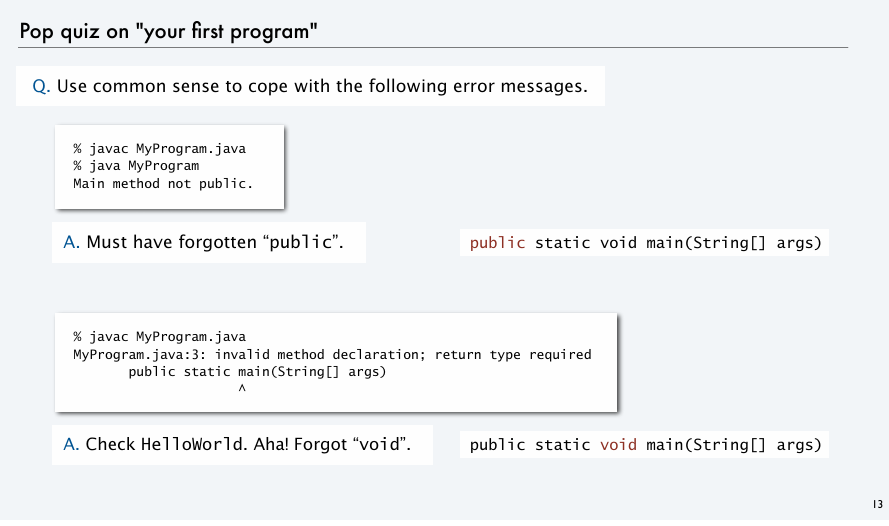
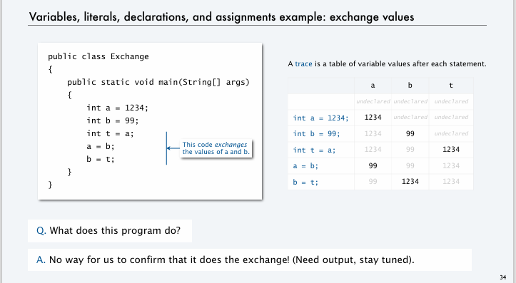
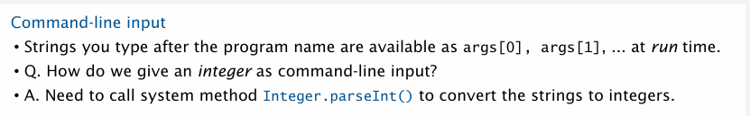
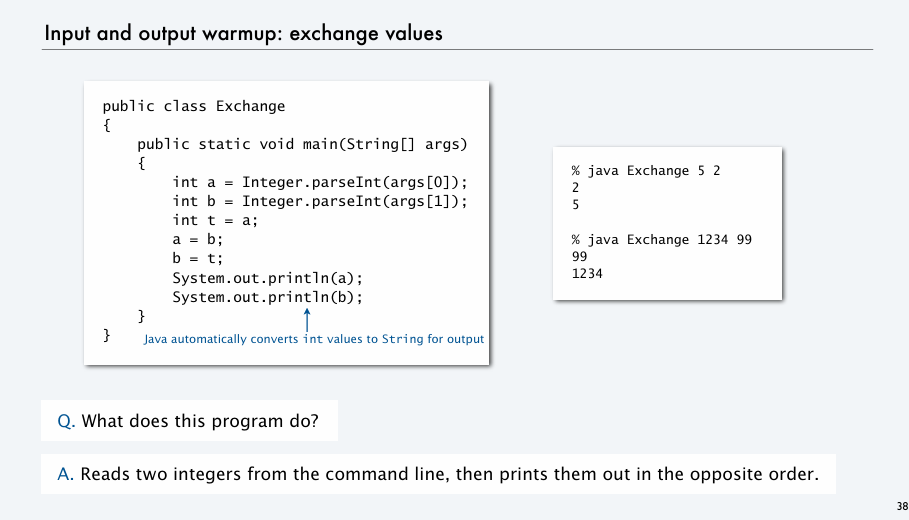
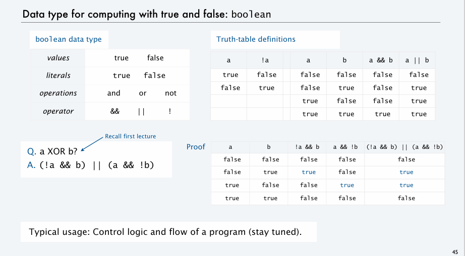
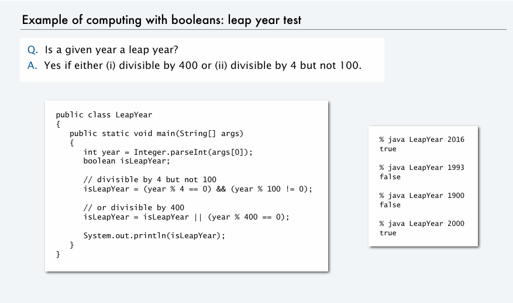
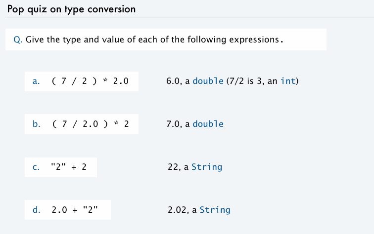
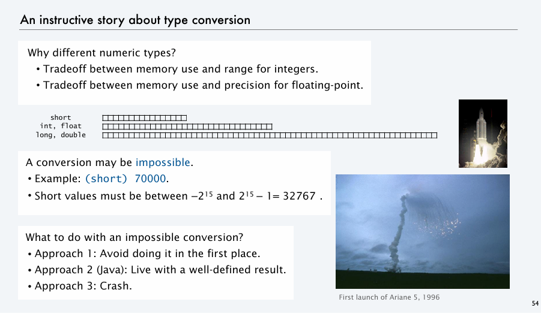
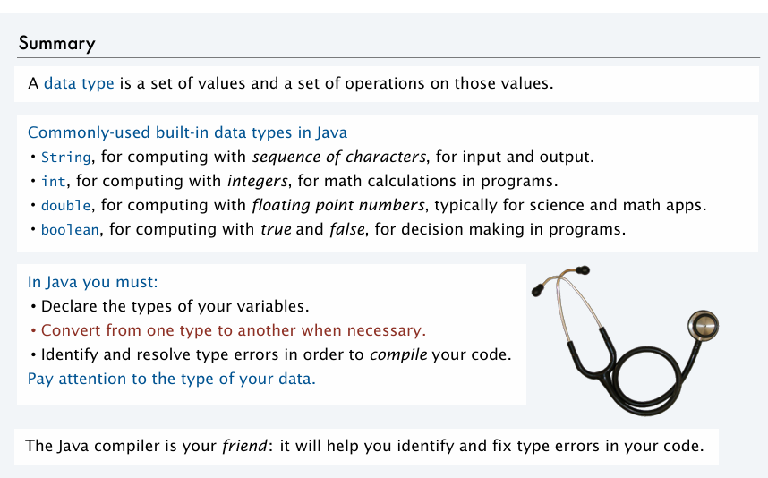

# Pop Quiz

1. Why programming?
2. Program development
3. Built-in data types
4. Type conversion

# Why programming?

# Built-in data types

1. What is a data types ?
    A set of values and set of operations on those values.

# Type conversion

# Summary

