# Conditionals & Loops

1. Conditionals : the **if** statement
2. Loops: the **while** statement 
3. An alternative: the **for** loop
4. Nesting
5. Debugging

# Conditionals : the **if** statement

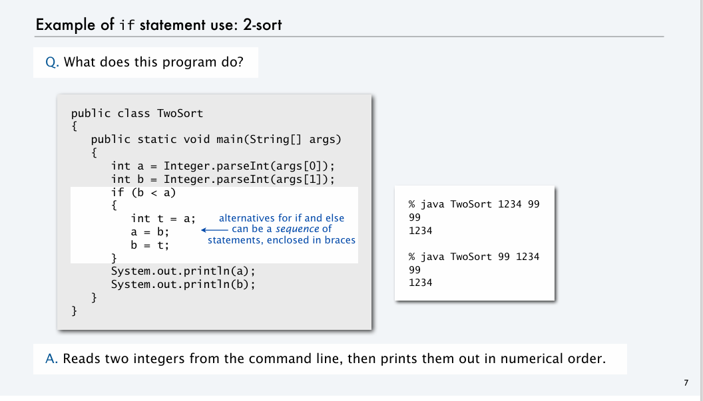
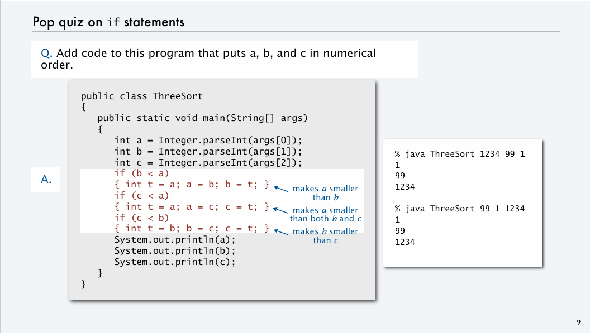

# Loops: the **while** statement 

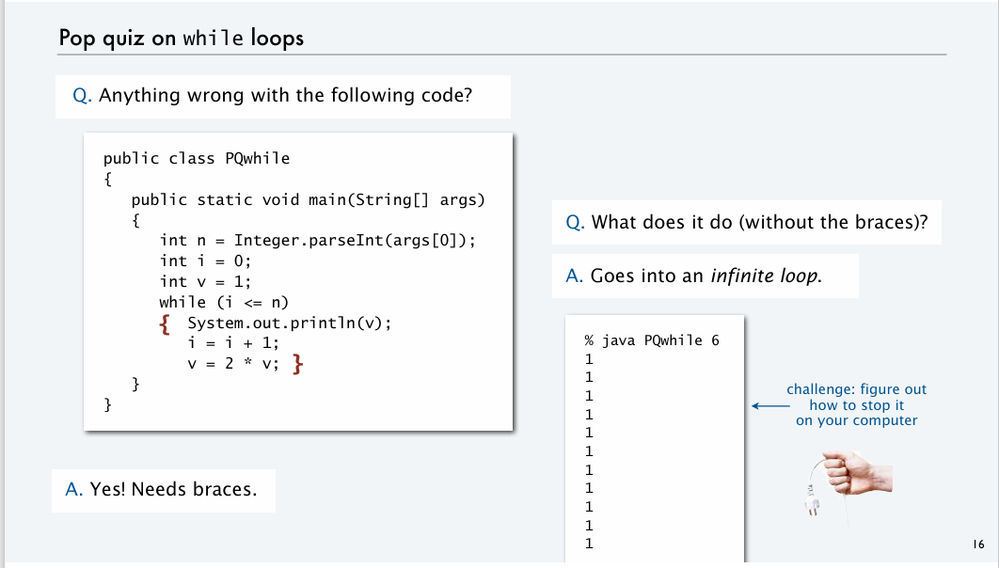

# An alternative: the **for** loop

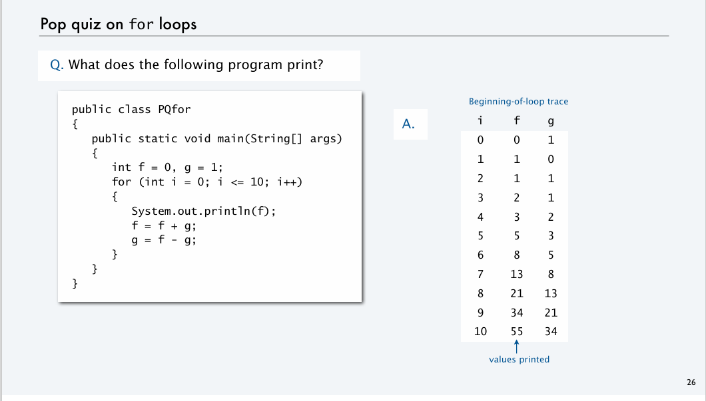

# Nesting

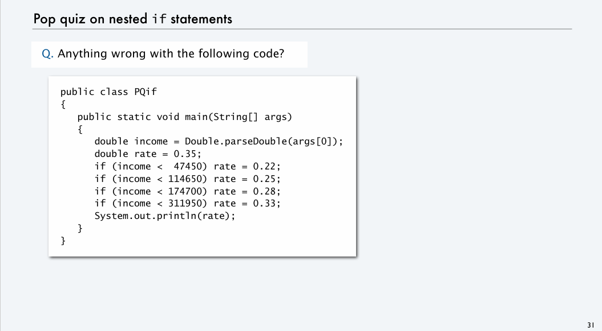
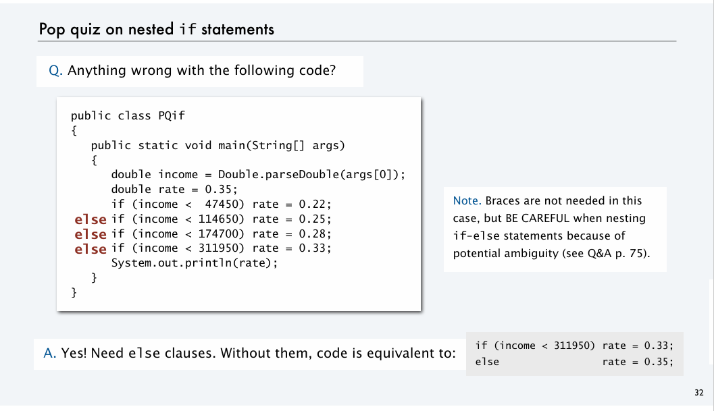
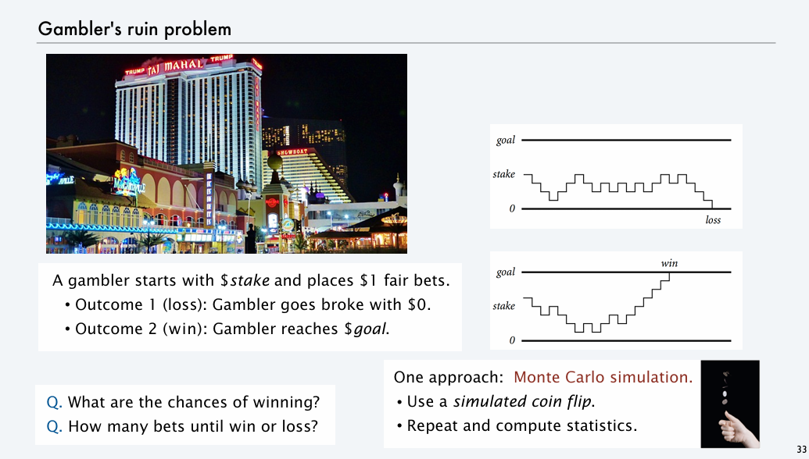
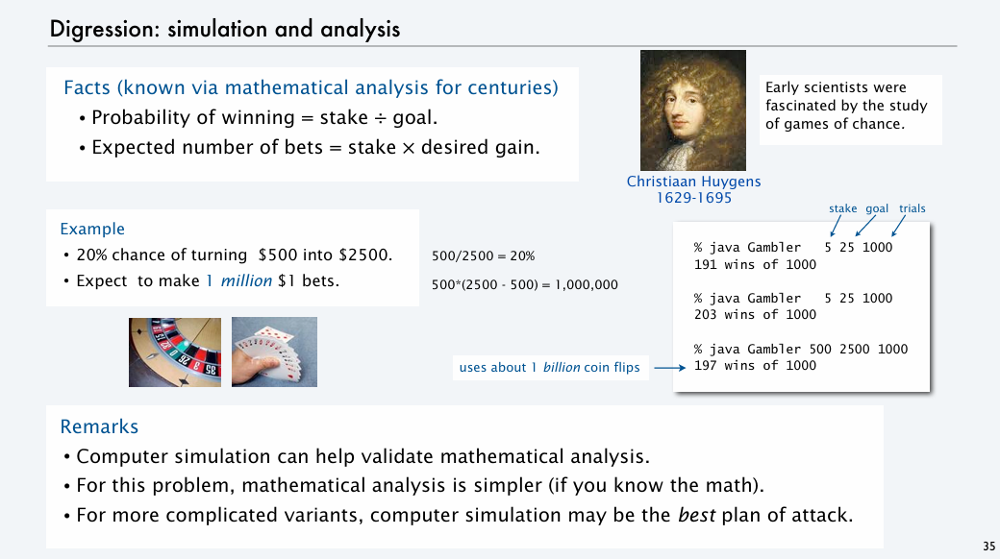

# Debugging

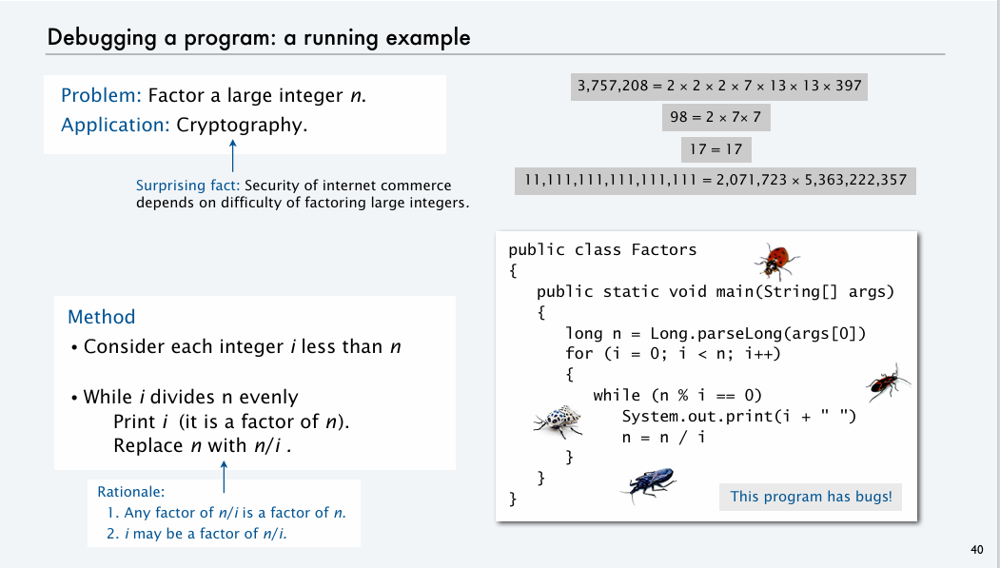
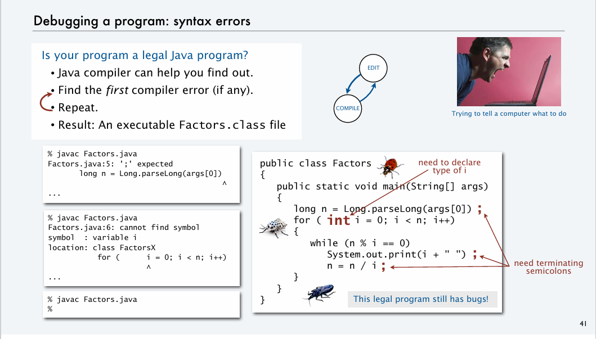
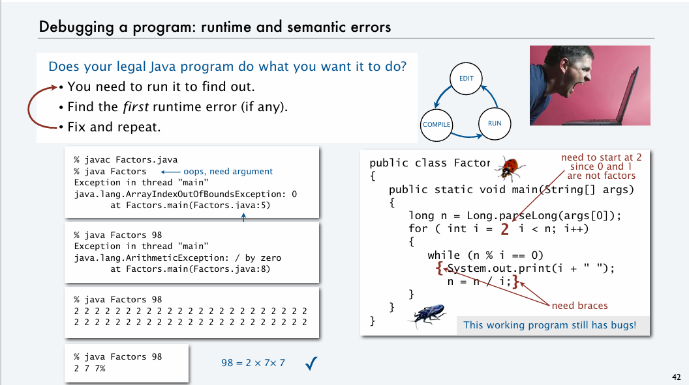
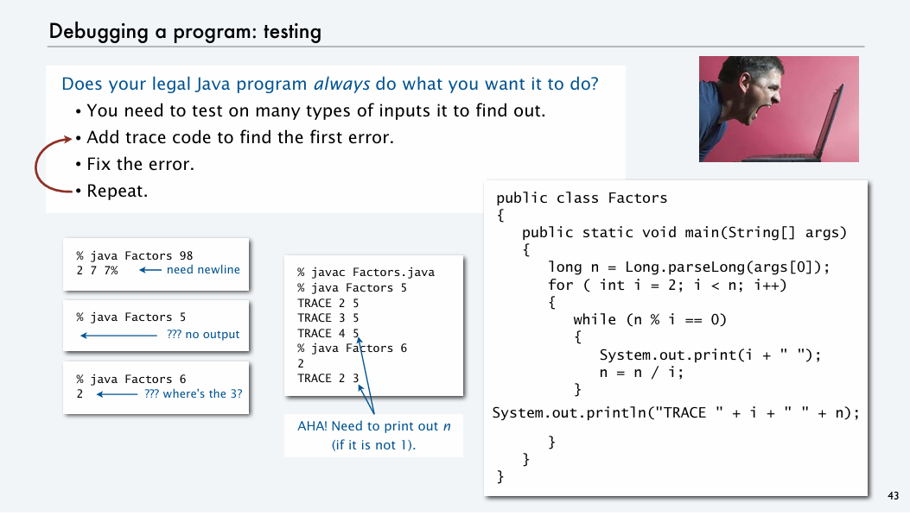
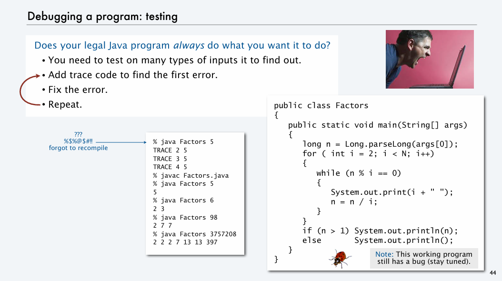
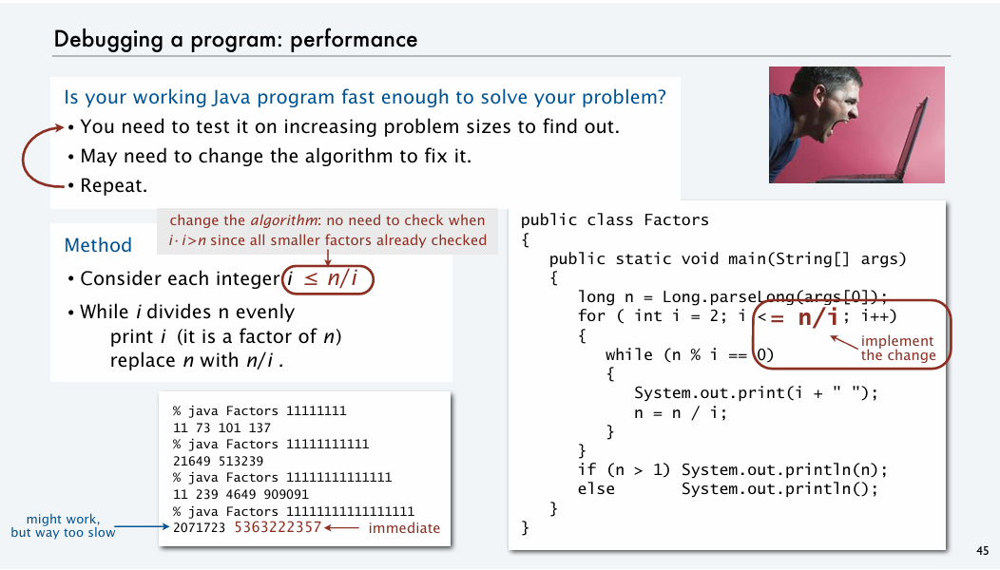
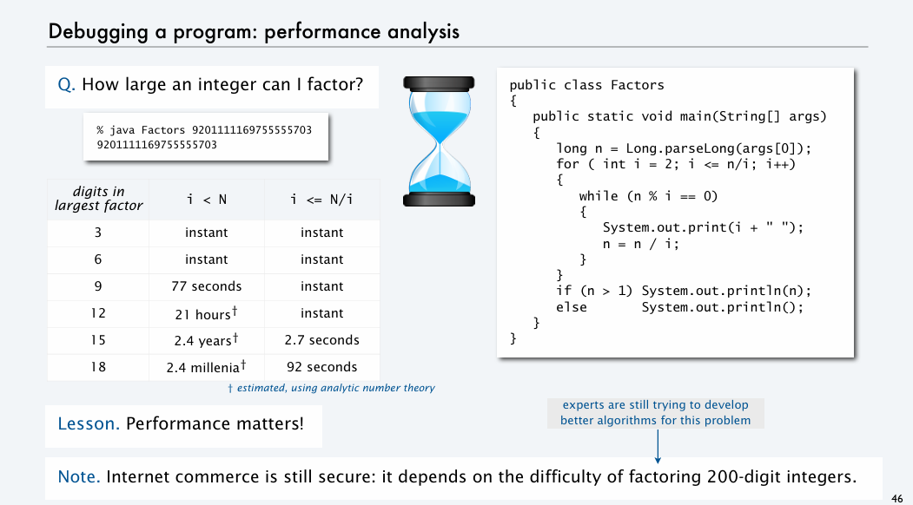

# Summary 

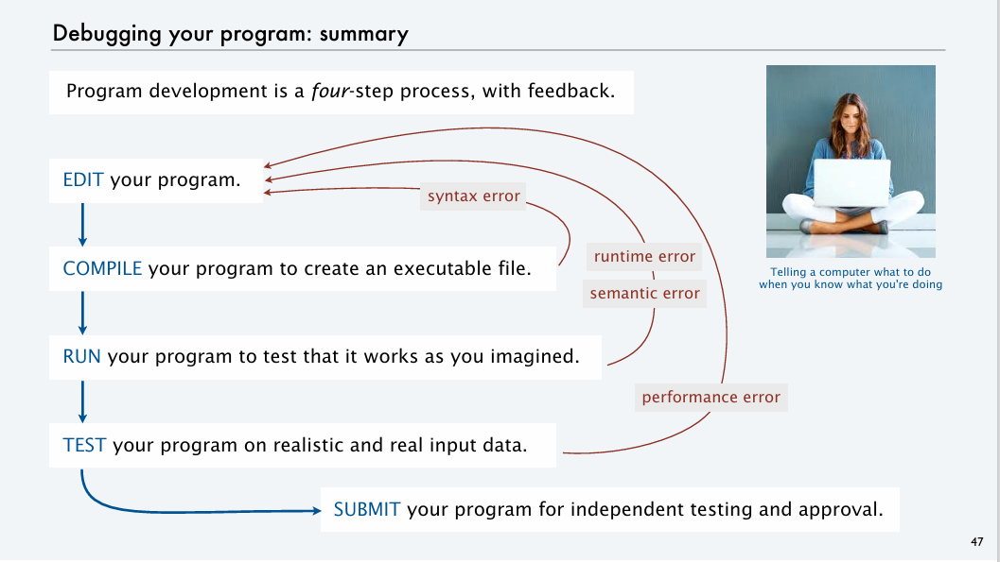